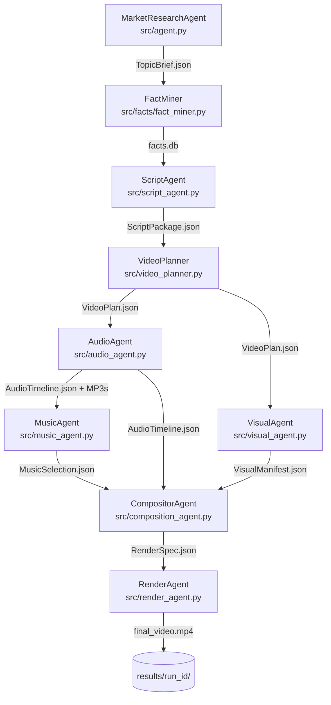

# Video Agent — AI Video Pipeline

An end-to-end multi-agent system that turns a topic string into a narrated YouTube Short (9:16 MP4) with zero manual steps.

```
"cheese facts"  -->  [9 agents]  -->  final_video.mp4
```

---

## Architecture

Each agent consumes a typed JSON artifact from the previous stage and emits one for the next. No shared mutable state between agents.



AudioAgent and VisualAgent both consume `VideoPlan.json` independently — the natural parallel execution boundary in the pipeline.

---

## Pipeline Stages

| # | Agent | Source File | Input | Output |
|---|-------|------------|-------|--------|
| 0 | MarketResearchAgent | `src/agent.py` | topic keyword | `TopicBrief.json` |
| 1 | FactMiner | `src/facts/fact_miner.py` | `TopicBrief.json` | `facts.db` |
| 2 | ScriptAgent | `src/script_agent.py` | `TopicBrief.json` + facts | `ScriptPackage.json` |
| 3 | VideoPlanner | `src/video_planner.py` | `ScriptPackage.json` | `VideoPlan.json` |
| 4 | AudioAgent | `src/audio_agent.py` | `VideoPlan.json` | `AudioTimeline.json` + MP3s |
| 5 | MusicAgent | `src/music_agent.py` | `AudioTimeline.json` | `MusicSelection.json` |
| 6 | VisualAgent | `src/visual_agent.py` | `VideoPlan.json` | `VisualManifest.json` |
| 7 | CompositorAgent | `src/composition_agent.py` | VideoPlan + Audio + Visual + Music | `RenderSpec.json` |
| 8 | RenderAgent | `src/render_agent.py` | `RenderSpec.json` | `final_video.mp4` |

---

## Quickstart

**Prerequisites:** Python 3.10+, FFmpeg on PATH ([Windows install](https://www.gyan.dev/ffmpeg/builds/))

### 1. Install

```bash
git clone <repo-url>
cd video_agent
python -m venv venv
source venv/Scripts/activate   # Windows Git Bash
# .\venv\Scripts\Activate.ps1  # PowerShell
pip install -r requirements.txt
```

### 2. Configure API keys

```bash
cp .env.example .env
# Edit .env and fill in your keys (see API Keys section below)
```

### 3. Preflight check

```bash
python main.py preflight
```

### 4. Run the full pipeline

```bash
python run_pipeline.py "cheese facts" --engine ffmpeg
```

Output lands in `results/sample_<date>_cheese_facts_<id>/final_video.mp4`.

**No API keys yet?** Run with the dry-run engine to validate pipeline wiring without rendering:

```bash
python run_pipeline.py "cheese facts" --engine dry_run
```

---

## Example Output

**Cheese History Facts** — generated end-to-end by the pipeline (Chatterbox TTS voiceover, Pexels images, FFmpeg render):

[](https://github.com/hyang0129/video_agent/releases/download/v0.1.0-demo/final_video.mp4)

A successful pipeline run produces this artifact layout:

```
results/sample_2026-03-08_cheese_history_facts_f77975/
    topic_brief.json        <- Stage 0: market research result
    facts.db                <- Stage 1: mined facts from YouTube captions
    script_package.json     <- Stage 2: voiceover script with timing
    video_plan.json         <- Stage 3: scene-by-scene video plan
    audio_timeline.json     <- Stage 4: TTS timeline manifest
    audio_segments/         <- Stage 4: per-scene MP3 voiceover files
    music_selection.json    <- Stage 5: background music selection
    visual_manifest.json    <- Stage 6: per-scene image assets
    images/                 <- Stage 6: downloaded Pexels images (or placeholder BMPs)
    render_spec.json        <- Stage 7: complete FFmpeg render specification
    final_video.json        <- Stage 8: render result metadata
    final_video.mp4         <- Stage 8: 9:16 vertical short (15-60s)
```

Target format: faceless, caption-first, Chatterbox TTS voiceover (local GPU, no API cost), Pexels stock images, FFmpeg-rendered with `drawtext` subtitle overlays.

---

## API Keys

| Key | Required For | Where to Get |
|-----|-------------|--------------|
| `YOUTUBE_API_KEY` | Stage 0 (market research) | [Google Cloud Console](https://console.cloud.google.com/apis/credentials) — enable YouTube Data API v3 |
| `ANTHROPIC_API_KEY` | Stages 2-3 (script, video plan) | [Anthropic Console](https://console.anthropic.com/settings/keys) |
| `GOOGLE_API_KEY` | Alternative to Anthropic | [AI Studio](https://aistudio.google.com/app/apikey) — free tier |
| `ELEVENLABS_API_KEY` | Stage 4 (TTS voiceover, ElevenLabs backend only) | [ElevenLabs](https://elevenlabs.io/app/settings/api-keys) — free tier: 10k chars/month. Not required when using Chatterbox TTS (default). |
| `PEXELS_API_KEY` | Stage 6 (image search) | [Pexels](https://www.pexels.com/api/) — falls back to placeholder BMPs if absent |

Set `LLM_PROVIDER=claude` (default) or `LLM_PROVIDER=google` in `.env` to choose the LLM backend.

---

## Stage-by-Stage CLI

Each stage is independently invokable via `main.py`:

```bash
# Market research only
python main.py example1

# Script from an existing TopicBrief
python main.py script results/<mr_run>/topicbrief_*.json

# Video plan from a ScriptPackage
python main.py videoplan results/<sg_run>/script_package.json

# Audio (TTS voiceover) from a VideoPlan
python main.py audio results/<vp_run>/video_plan.json

# Image retrieval from a ScriptPackage (beat-aligned candidates)
python main.py scriptimages results/<sg_run>/script_package.json

# Visual manifest from a VideoPlan
python main.py visualmanifest results/<vp_run>/video_plan.json

# Render spec from plan + audio + visuals
python main.py renderspec <video_plan.json> <audio_timeline.json> <visual_manifest.json>

# Render to MP4
python main.py render results/<run>/render_spec.json ffmpeg

# Full MVP from TopicBrief (stages 2-8)
python main.py mvp results/<mr_run>/topicbrief_*.json ffmpeg
```

---

## Running Tests

```bash
# Run the full test suite
pytest tests/ -v

# Run integration tests for a specific stage (no full pipeline needed)
pytest tests/integration/ -v -s -m integration -k "stage_3"
```

See [docs/integration-testing.md](docs/integration-testing.md) for per-stage test commands, fixture management, and API key requirements.

Canonical test fixture: `tests/fixtures/script_package_ww2_tanks.json`

---

## Project Structure

```
video_agent/
    src/
        agent.py                 # Market research agent
        script_agent.py          # Script generation agent
        video_planner.py         # Video planning logic
        video_agent.py           # Video planning agent wrapper
        audio_agent.py           # TTS audio generation agent
        music_agent.py           # Background music selection
        visual_agent.py          # Image retrieval agent
        script_image_agent.py    # Beat-aligned image retrieval
        composition_agent.py     # Render spec compositor
        render_agent.py          # FFmpeg render engine
        config.py                # All configuration and thresholds
        creative_spec.py         # Channel-level creative defaults
        tools/                   # YouTube API, TTS, image search tool implementations
        facts/                   # Fact miner (YouTube caption extraction)
        artifacts/               # JSON artifact I/O utilities
    tests/
        fixtures/                # Cached JSON artifacts for offline testing
        integration/             # Per-stage integration tests
    docs/                        # Architecture and design docs
    results/                     # Per-run output artifacts (gitignored)
    assets/                      # Static assets (default music track, etc.)
    main.py                      # Stage-by-stage CLI entry point
    run_pipeline.py              # Full pipeline runner (topic string -> MP4)
    requirements.txt
    .env.example
    creative_spec.example.json   # Channel defaults template
    ROADMAP.md                   # Canonical task and priority tracking
```

---

## Tech Stack

| Component | Technology |
|-----------|-----------|
| Agent orchestration | LangChain 0.3.x |
| LLM (default) | Anthropic Claude (claude-sonnet) |
| LLM (alternative) | Google Gemini (via langchain-google-genai) |
| TTS voiceover | [Chatterbox Turbo TTS](vendor/chatterbox/) (local GPU, default) or ElevenLabs API (`TTS_BACKEND=elevenlabs`) |
| Image retrieval | Pexels API |
| Video rendering | FFmpeg (local, zero cloud cost) |
| Artifact format | Typed JSON files |
| Tests | pytest |
| Python | 3.10.11 |

---

## Live2D Avatar Integration *(experimental — not required for core pipeline)*

The pipeline has an optional avatar rendering stage under active development.
When mature, video_agent will act as the director: running [Rhubarb Lip Sync](https://github.com/DanielSWolf/rhubarb-lip-sync)
on each audio segment, generating emotion/reaction cues from the script via LLM,
and writing an `AvatarSceneManifest.json` per scene. The live2d renderer would then
be invoked as a subprocess and its transparent-background output composited over
scene imagery by FFmpeg.

**Status:** Interface specified, components stubbed (`src/rhubarb_agent.py`, `src/avatar_packaging_agent.py`). Not wired into the main pipeline. Faceless voiceover output works without this.

The full interface spec is in [docs/live2d-avatar-api-contract.md](docs/live2d-avatar-api-contract.md).

---

## Performance

The orchestrator supports both **serial** and **parallel** execution for the audio generation + image fetching stages (the two heaviest I/O-bound stages). All other stages have data dependencies and run sequentially.

| Mode | Description |
|------|-------------|
| `mcp-serial` | Audio generation runs first, then image fetching |
| `mcp-parallel` | Audio + image run concurrently via `asyncio.gather` |

**Reproducing the benchmark:**

```bash
python scripts/benchmark_parallel.py
```

This runs the WW2 tanks fixture through both modes and prints a wall-clock comparison. Results are saved to `results/benchmark_results.json`.

**Metrics tracking:** Every orchestrator run appends timing data to `results/metrics_summary.json` — per-run duration, stage-level timings, pass/fail status, and execution mode.

---

## Known Limitations

These are tracked in [ROADMAP.md](ROADMAP.md):

- **Audio continuity:** Voiceover can end before video duration in some renders. Full-duration padding is in progress (Tier 0.2).
- **Background music:** `MusicSelection.json` is generated but the music track is not yet mixed into the final MP4.
- **Ken Burns / transitions:** Specified in `RenderSpec.json` but not yet applied by the FFmpeg engine.
- **LUFS normalization:** Voiceover volume can be inconsistent across videos; `normalize_audio()` is stubbed.
- **Image relevance:** Scene images depend on Pexels keyword matching; CLIP semantic scoring is not yet wired in.
- **No CI:** GitHub Actions test runner is a Tier 1 item; tests must be run locally.

---

## Coding Conventions

**ASCII-only in `print()` and `logging`** — prevents `UnicodeEncodeError` on Windows CP1252 terminals.
Use bracketed tags: `[OK]`, `[ERROR]`, `[WARN]`, `[INFO]`, `[SKIP]`, `[WAIT]`, `[LLM]`, `[debug]`.
Non-ASCII is fine in comments, docstrings, and data strings (voiceover content, etc.).

---

## License

This project is licensed under PolyForm Noncommercial License 1.0.0.
Commercial use is not permitted under this license.

See [LICENSE](LICENSE) for full terms.
