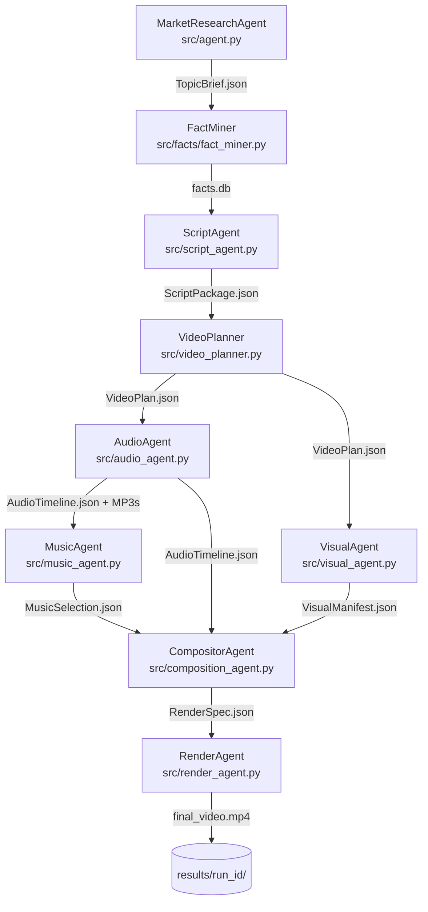
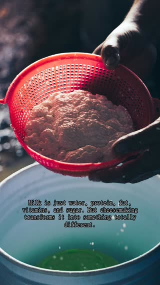

# Video Agent — AI Video Pipeline

An end-to-end multi-agent system that turns a topic string into a narrated YouTube Short (9:16 MP4) with zero manual steps.

```
"cheese facts"  -->  [9 agents]  -->  final_video.mp4
```

---

## Architecture

Each agent consumes a typed JSON artifact from the previous stage and emits one for the next. No shared mutable state between agents.



AudioAgent and VisualAgent both consume `VideoPlan.json` independently — the natural parallel execution boundary in the pipeline.

---

## Pipeline Stages

| # | Agent | Source File | Input | Output |
|---|-------|------------|-------|--------|
| 0 | MarketResearchAgent | `src/agent.py` | topic keyword | `TopicBrief.json` |
| 1 | FactMiner | `src/facts/fact_miner.py` | `TopicBrief.json` | `facts.db` |
| 2 | ScriptAgent | `src/script_agent.py` | `TopicBrief.json` + facts | `ScriptPackage.json` |
| 3 | VideoPlanner | `src/video_planner.py` | `ScriptPackage.json` | `VideoPlan.json` |
| 4 | AudioAgent | `src/audio_agent.py` | `VideoPlan.json` | `AudioTimeline.json` + MP3s |
| 5 | MusicAgent | `src/music_agent.py` | `AudioTimeline.json` | `MusicSelection.json` |
| 6 | VisualAgent | `src/visual_agent.py` | `VideoPlan.json` | `VisualManifest.json` |
| 7 | CompositorAgent | `src/composition_agent.py` | VideoPlan + Audio + Visual + Music | `RenderSpec.json` |
| 8 | RenderAgent | `src/render_agent.py` | `RenderSpec.json` | `final_video.mp4` |

---

## Quickstart

**Prerequisites:** Python 3.10+, FFmpeg on PATH

### 1. Install

```bash
git clone <repo-url>
cd video_agent
python -m venv venv
source venv/bin/activate
pip install -e .
```

### 2. Configure API keys and tool paths

```bash
cp .env.example .env
# Fill in API keys and tool paths (see sections below)
```

### 3. Preflight check

```bash
python main.py preflight
```

### 4. Run the full pipeline

```bash
# Full MCP pipeline test (exercises all 18 tools)
python scripts/run_full_mcp_pipeline.py

# Or run with a specific topic brief
python main.py pipeline tests/fixtures/topic_brief_cheese_facts.json --engine ffmpeg
```

Output lands in `results/test/full_mcp_pipeline/final_video.mp4`.

---

## Example Output

**Cheese History Facts** — generated end-to-end by the pipeline (Chatterbox TTS voiceover, Pexels images, FFmpeg render):

[](https://github.com/hyang0129/video_agent/releases/download/v0.1.0-demo/final_video.mp4)

A successful pipeline run produces this artifact layout:

```
results/sample_2026-03-08_cheese_history_facts_f77975/
    topic_brief.json        <- Stage 0: market research result
    facts.db                <- Stage 1: mined facts from YouTube captions
    script_package.json     <- Stage 2: voiceover script with timing
    video_plan.json         <- Stage 3: scene-by-scene video plan
    audio_timeline.json     <- Stage 4: TTS timeline manifest
    audio_segments/         <- Stage 4: per-scene MP3 voiceover files
    music_selection.json    <- Stage 5: background music selection
    visual_manifest.json    <- Stage 6: per-scene image assets
    images/                 <- Stage 6: downloaded Pexels images (or placeholder BMPs)
    render_spec.json        <- Stage 7: complete FFmpeg render specification
    final_video.json        <- Stage 8: render result metadata
    final_video.mp4         <- Stage 8: 9:16 vertical short (15-60s)
```

Target format: faceless, caption-first, Chatterbox TTS voiceover (local GPU, no API cost), Pexels stock images, FFmpeg-rendered with `drawtext` subtitle overlays.

---

## API Keys

| Variable | Required For | Where to Get |
|----------|-------------|--------------|
| `YOUTUBE_API_KEY` | Market research | [Google Cloud Console](https://console.cloud.google.com/apis/credentials) — enable YouTube Data API v3 |
| `ANTHROPIC_API_KEY` | Script + screenplay (default LLM) | [Anthropic Console](https://console.anthropic.com/settings/keys) |
| `GOOGLE_API_KEY` | Alternative LLM | [AI Studio](https://aistudio.google.com/app/apikey) — free tier |
| `ELEVENLABS_API_KEY` | TTS (ElevenLabs backend only) | [ElevenLabs](https://elevenlabs.io/app/settings/api-keys) — not needed with Chatterbox |
| `PEXELS_API_KEY` | Image retrieval | [Pexels](https://www.pexels.com/api/) — falls back to placeholder BMPs if absent |

Set `LLM_PROVIDER=claude` (default) or `LLM_PROVIDER=google` in `.env` to select the LLM backend.

---

## Tool Paths

These paths are **environment-specific** and must be set in `.env`. No defaults are baked into source code — an unset path fails loudly rather than silently using a wrong location.

| Variable | Used By | Notes |
|----------|---------|-------|
| `CHATTERBOX_APP_DIR` | `chatterbox_server_manager` | Root of the chatterbox repo (contains `app/main.py`). TTS degrades to silence if absent. |
| `CHATTERBOX_UVICORN` | `chatterbox_server_manager` | Path to `uvicorn` in the chatterbox venv. Only needed for auto-start. |
| `RHUBARB_PATH` | `rhubarb_agent` | Rhubarb Lip Sync binary. Lip-sync degrades to silent neutral pose if absent. |
| `LIVE2D_RENDER_PATH` | `avatar_render_agent` | `live2d-render` binary (built from `repos/live2d`). Avatar render fails if absent. |
| `LIVE2D_REPO_ROOT` | `avatar_render_agent` | Root of the live2d repo — the binary's working directory for asset resolution. |
| `LIVE2D_MODEL_PATH` | `avatar_packaging_agent` | Full path to the `.model3.json` model file. |

**Run `python scripts/run_full_mcp_pipeline.py`** to get an immediate availability report for all three external tools before the pipeline runs.

See **[docs/setup-external-tools.md](docs/setup-external-tools.md)** for build/install instructions for each tool.

---

## CLI

```bash
# Preflight: check API keys and tool paths
python main.py preflight

# Screenplay mode: interactive concept selection, then full production
python main.py screenplay tests/fixtures/topic_brief_cheese_facts.json

# Pipeline mode: non-interactive, topic brief → final_video.mp4
python main.py pipeline tests/fixtures/topic_brief_cheese_facts.json --engine ffmpeg

# Full MCP pipeline test (all 18 tools, with pre-flight availability report)
python scripts/run_full_mcp_pipeline.py
```

Individual pipeline stages can also be called via the MCP tools directly using `_call_tool_inprocess` — see `scripts/run_full_mcp_pipeline.py` for examples.

---

## Running Tests

```bash
# Run the full test suite
pytest tests/ -v

# Run integration tests for a specific stage (no full pipeline needed)
pytest tests/integration/ -v -s -m integration -k "stage_3"
```

See [docs/integration-testing.md](docs/integration-testing.md) for per-stage test commands, fixture management, and API key requirements.

Canonical test fixture: `tests/fixtures/script_package_ww2_tanks.json`

---

## Project Structure

```
video_agent/
    video_agent/           # Installable package (pip install -e .)
        agent.py                 # Market research agent
        script_agent.py          # Script generation agent
        video_planner.py         # Video planning logic
        audio_agent.py           # TTS audio generation agent
        composition_agent.py     # Render spec compositor
        render_agent.py          # FFmpeg render engine
        rhubarb_agent.py         # Lip-sync cue generation (Rhubarb)
        avatar_cue_agent.py      # Emotion/reaction cue generation
        avatar_packaging_agent.py # AvatarSceneManifest builder
        avatar_render_agent.py   # live2d-render subprocess wrapper
        orchestrator.py          # ProductionOrchestrator (parallel audio+image)
        config.py                # All configuration (paths from .env)
        mcp/
            video_agent_server.py  # MCP server — 18 tools over HTTPS
        tools/                   # YouTube API, TTS, image search, chatterbox
        facts/                   # Fact miner (YouTube caption extraction)
        artifacts/               # JSON artifact I/O utilities
        screenwriting/           # Concept, screenplay, feasibility agents
    tests/
        fixtures/                # Cached JSON artifacts for offline testing
        integration/             # Per-stage integration tests
    scripts/
        run_full_mcp_pipeline.py # Full 18-tool pipeline test with pre-flight check
        benchmark_parallel.py    # Serial vs parallel execution benchmark
    docs/                        # Architecture and design docs
    results/                     # Per-run output artifacts (gitignored)
    assets/                      # Static assets (default music track, etc.)
    main.py                      # Shim → video_agent/main.py
    video_agent/main.py          # CLI entry point (preflight, screenplay, pipeline)
    pyproject.toml               # Package build config (hatchling)
    requirements.txt
    .env                         # API keys + tool paths (not committed)
    ROADMAP.md                   # Canonical task and priority tracking
```

---

## Tech Stack

| Component | Technology |
|-----------|-----------|
| Agent orchestration | LangChain 0.3.x |
| LLM (default) | Anthropic Claude (claude-sonnet) |
| LLM (alternative) | Google Gemini (via langchain-google-genai) |
| TTS voiceover | [Chatterbox Turbo TTS](vendor/chatterbox/) (local GPU, default) or ElevenLabs API (`TTS_BACKEND=elevenlabs`) |
| Image retrieval | Pexels API |
| Video rendering | FFmpeg (local, zero cloud cost) |
| Artifact format | Typed JSON files |
| Tests | pytest |
| Python | 3.10.11 |

---

## Live2D Avatar Integration *(optional — requires local GPU build)*

The pipeline has a working avatar rendering stage wired into the full MCP pipeline. It adds three MCP tools after audio generation:

| Tool | What it does |
|------|-------------|
| `generate_lipsync` | Runs [Rhubarb Lip Sync](https://github.com/DanielSWolf/rhubarb-lip-sync) on each voiceover MP3. Degrades gracefully to silent-pose cues if Rhubarb is not installed. |
| `package_avatar` | Converts lipsync cues + emotion cues into a single continuous `AvatarSceneManifest.json` with concatenated audio. |
| `render_avatar` | Invokes `live2d-render` (built from `repos/live2d`) to produce `avatar_takes/avatar_full.mov` with transparent background. |

`render_video` accepts an optional `avatar_manifest` parameter — when provided, the `.mov` is composited over scene imagery by FFmpeg (head+shoulders crop, bottom overlay).

**Requirements:** Set `LIVE2D_RENDER_PATH`, `LIVE2D_REPO_ROOT`, and `LIVE2D_MODEL_PATH` in `.env`. The `live2d-render` binary requires OpenGL/EGL (Mesa or GPU). Faceless voiceover output works without this.

The full interface spec is in [docs/live2d-avatar-api-contract.md](docs/live2d-avatar-api-contract.md).

---

## Performance

The orchestrator supports both **serial** and **parallel** execution for the audio generation + image fetching stages (the two heaviest I/O-bound stages). All other stages have data dependencies and run sequentially.

| Mode | Description |
|------|-------------|
| `mcp-serial` | Audio generation runs first, then image fetching |
| `mcp-parallel` | Audio + image run concurrently via `asyncio.gather` |

**Reproducing the benchmark:**

```bash
python scripts/benchmark_parallel.py
```

This runs the WW2 tanks fixture through both modes and prints a wall-clock comparison. Results are saved to `results/benchmark_results.json`.

**Metrics tracking:** Every orchestrator run appends timing data to `results/metrics_summary.json` — per-run duration, stage-level timings, pass/fail status, and execution mode.

---

## Known Limitations

These are tracked in [ROADMAP.md](ROADMAP.md):

- **Audio continuity:** Voiceover can end before video duration in some renders. Full-duration padding is in progress (Tier 0.2).
- **Background music:** `MusicSelection.json` is generated but the music track is not yet mixed into the final MP4.
- **Ken Burns / transitions:** Specified in `RenderSpec.json` but not yet applied by the FFmpeg engine.
- **LUFS normalization:** Voiceover volume can be inconsistent across videos; `normalize_audio()` is stubbed.
- **Image relevance:** Scene images depend on Pexels keyword matching; CLIP semantic scoring is not yet wired in.
- **No CI:** GitHub Actions test runner is a Tier 1 item; tests must be run locally.

---

## Coding Conventions

**ASCII-only in `print()` and `logging`** — prevents `UnicodeEncodeError` on Windows CP1252 terminals.
Use bracketed tags: `[OK]`, `[ERROR]`, `[WARN]`, `[INFO]`, `[SKIP]`, `[WAIT]`, `[LLM]`, `[debug]`.
Non-ASCII is fine in comments, docstrings, and data strings (voiceover content, etc.).

---

## License

This project is licensed under PolyForm Noncommercial License 1.0.0.
Commercial use is not permitted under this license.

See [LICENSE](LICENSE) for full terms.
